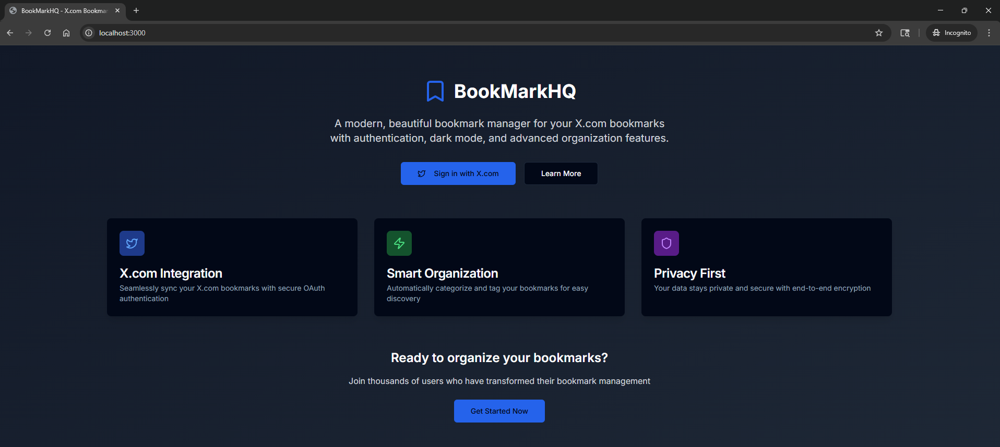

<p align="center">
  <a href="https://github.com/Jineshkumar1/BookmarkHQ/blob/main/BookmarkHQ-Demo.webm?raw=true">
    <strong>⬇️ Download Demo Video (WEBM)</strong>
  </a>
</p>


A full-stack web application for managing and organizing your X.com (formerly Twitter) bookmarks with intelligent caching and modern UI.

## Features

- 🔐 **OAuth 2.0 Authentication** with X.com
- 📚 **Smart Caching** with Supabase to reduce API calls
- 🎨 **Modern UI** built with Tailwind CSS and shadcn/ui
- 📱 **Responsive Design** works on all devices
- 🔍 **Advanced Filtering** by categories and tags
- 📊 **Analytics Dashboard** with bookmark statistics
- ⚡ **Fast Performance** with server-side caching
- 🔄 **Real-time Sync** with X.com API
- 🛡️ **Rate Limit Protection** with intelligent request management

## Tech Stack

- **Frontend**: Next.js 14, React 18, TypeScript
- **Styling**: Tailwind CSS, shadcn/ui components
- **Authentication**: NextAuth.js with OAuth 2.0 PKCE
- **Database**: Supabase (PostgreSQL) for caching
- **API**: X.com API v2
- **Deployment**: Vercel-ready

## Quick Start

### Prerequisites

1. **X.com Developer Account**
   - Create an app at [developer.x.com](https://developer.x.com)
   - Enable OAuth 2.0 with PKCE
   - Add callback URL: `http://localhost:3000/api/auth/callback/twitter`

2. **Supabase Account** (for caching)
   - Sign up at [supabase.com](https://supabase.com)
   - Create a new project
   - Follow the [Supabase Setup Guide](./SUPABASE_SETUP.md)

### Installation

1. **Clone the repository**
   ```bash
   git clone <repository-url>
   cd BookMarkHQlocal
   ```

2. **Install dependencies**
   ```bash
   npm install
   ```

3. **Set up environment variables**
   ```bash
   cp env.template .env.local
   ```
   
   Edit `.env.local` with your credentials:
   ```env
   # NextAuth Configuration
   NEXTAUTH_URL="http://localhost:3000"
   NEXTAUTH_SECRET="your-nextauth-secret-key"
   
   # X.com API Configuration
   TWITTER_CLIENT_ID="your-twitter-client-id"
   TWITTER_CLIENT_SECRET="your-twitter-client-secret"
   
   # Supabase Configuration
   NEXT_PUBLIC_SUPABASE_URL="https://your-project-id.supabase.co"
   NEXT_PUBLIC_SUPABASE_ANON_KEY="your-anon-key"
   SUPABASE_SERVICE_ROLE_KEY="your-service-role-key"
   ```

4. **Set up database schema**
   - Go to your Supabase dashboard
   - Navigate to SQL Editor
   - Run the contents of `scripts/supabase-setup.sql`

5. **Start the development server**
   ```bash
   npm run dev
   ```

6. **Open your browser**
   Navigate to [http://localhost:3000](http://localhost:3000)

## How It Works

### Authentication Flow
1. User clicks "Sign in with X.com"
2. Redirected to X.com OAuth consent screen
3. User authorizes the application
4. Redirected back with authorization code
5. Server exchanges code for access token
6. User is authenticated and can access bookmarks

### Caching System
1. **First Request**: Fetches bookmarks from X.com API and stores in Supabase
2. **Subsequent Requests**: Serves bookmarks from cache if less than 1 hour old
3. **Force Refresh**: "Sync from X.com" button bypasses cache
4. **Cache Management**: Cache Status component shows cache info and controls

### API Rate Limiting
- Intelligent request throttling to respect X.com API limits
- Automatic retry with exponential backoff
- User-friendly error messages for rate limit exceeded

## Project Structure

```
BookMarkHQlocal/
├── app/                    # Next.js 14 app directory
│   ├── api/               # API routes
│   │   ├── auth/          # NextAuth.js routes
│   │   ├── bookmarks/     # Bookmarks API
│   │   └── cache/         # Cache management API
│   ├── dashboard/         # Main dashboard page
│   └── auth/              # Authentication pages
├── components/            # React components
│   ├── ui/               # shadcn/ui components
│   ├── bookmark-card.tsx # Individual bookmark display
│   ├── cache-status.tsx  # Cache management UI
│   └── ...
├── lib/                  # Utility libraries
│   ├── auth.ts          # NextAuth.js configuration
│   ├── supabase.ts      # Supabase client and helpers
│   └── x-api.ts         # X.com API integration
├── scripts/             # Database setup scripts
└── types/               # TypeScript type definitions
```

## API Endpoints

### Authentication
- `GET /api/auth/signin` - Sign in page
- `GET /api/auth/signout` - Sign out
- `GET /api/auth/callback/twitter` - OAuth callback

### Bookmarks
- `GET /api/bookmarks` - Fetch user bookmarks
- `POST /api/bookmarks` - Add bookmark
- `DELETE /api/bookmarks` - Remove bookmark

### Cache Management
- `GET /api/cache` - Get cache status
- `DELETE /api/cache` - Clear cache
- `POST /api/cache` - Refresh cache

## Configuration

### Environment Variables

| Variable | Description | Required |
|----------|-------------|----------|
| `NEXTAUTH_URL` | Your application URL | Yes |
| `NEXTAUTH_SECRET` | NextAuth.js secret key | Yes |
| `TWITTER_CLIENT_ID` | X.com app client ID | Yes |
| `TWITTER_CLIENT_SECRET` | X.com app client secret | Yes |
| `NEXT_PUBLIC_SUPABASE_URL` | Supabase project URL | Yes |
| `NEXT_PUBLIC_SUPABASE_ANON_KEY` | Supabase anonymous key | Yes |
| `SUPABASE_SERVICE_ROLE_KEY` | Supabase service role key | Yes |

### X.com App Configuration

Required scopes:
- `tweet.read` - Read tweets
- `users.read` - Read user information
- `bookmark.read` - Read bookmarks
- `offline.access` - Refresh tokens

Callback URLs:
- Development: `http://localhost:3000/api/auth/callback/twitter`
- Production: `https://yourdomain.com/api/auth/callback/twitter`

## Development

### Available Scripts

```bash
npm run dev          # Start development server
npm run build        # Build for production
npm run start        # Start production server
npm run lint         # Run ESLint
```

### Database Schema

The application uses two main tables:

1. **bookmarks_cache** - Stores cached bookmark data
   - `user_id` - X.com user ID
   - `data` - JSON containing bookmarks and metadata
   - `last_synced_at` - Timestamp of last sync

2. **sync_logs** - Tracks synchronization operations
   - `user_id` - X.com user ID
   - `sync_type` - Type of sync (manual/scheduled/auto)
   - `status` - Success/error/partial
   - `bookmarks_added` - Number of bookmarks added
   - `error_message` - Error details if failed

## Deployment

### Vercel Deployment

1. **Connect your repository** to Vercel
2. **Set environment variables** in Vercel dashboard
3. **Deploy** - Vercel will automatically build and deploy

### Environment Variables for Production

Update your X.com app callback URL to your production domain:
```
https://yourdomain.com/api/auth/callback/twitter
```

### Database Setup

1. Create a Supabase project
2. Run the database setup script
3. Configure environment variables
4. Test the connection

## Troubleshooting

### Common Issues

1. **Authentication Errors**
   - Verify X.com app configuration
   - Check callback URLs match exactly
   - Ensure required scopes are enabled

2. **Cache Issues**
   - Verify Supabase credentials
   - Check database schema is set up
   - Review cache status component

3. **Rate Limiting**
   - Wait 15 minutes before retrying
   - Check X.com API usage dashboard
   - Consider reducing request frequency

### Debug Tools

- `/debug` - Session and environment variable debug page
- `/test` - API connection test page
- Browser console - Detailed error logs
- Network tab - API request monitoring

## Contributing

1. Fork the repository
2. Create a feature branch
3. Make your changes
4. Add tests if applicable
5. Submit a pull request

## License

This project is licensed under the MIT License - see the LICENSE file for details.

## Support

- Check the [Troubleshooting Guide](./TROUBLESHOOTING.md)
- Review the [Supabase Setup Guide](./SUPABASE_SETUP.md)
- Open an issue for bugs or feature requests

## Roadmap

- [ ] Advanced bookmark organization
- [ ] Export/import functionality
- [ ] Collaborative bookmark sharing
- [ ] Mobile app
- [ ] Browser extension
- [ ] Advanced analytics
- [ ] AI-powered categorization
